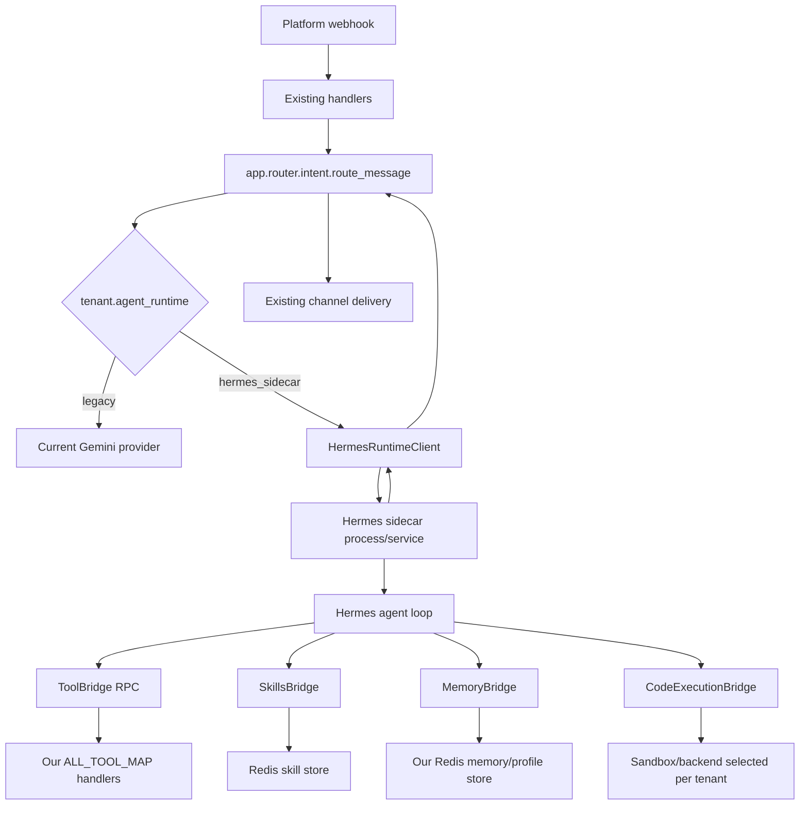

# 00 Architecture

## Goal

Introduce Hermes as a complete Agent OS runtime behind our production bot shell.

The production shell remains responsible for:

- Platform ingress and egress: Feishu, WeCom, WeCom KF, QQ.
- Tenant identity, channel identity, user identity, and access control.
- Business tools, tenant allowlists, trial, quotas, metering, reminders, provisioning, and delivery guarantees.
- Deployment, observability, and incident response.

Hermes becomes responsible for runtime substrate capabilities:

- Agent loop and tool-call orchestration.
- Context engine and compression strategy.
- Memory provider lifecycle hooks.
- Skills and self-improvement loop.
- Subagents and parallel workstreams.
- Code execution environment abstraction.
- Provider selection, credential pool, MCP integration, and checkpoint-aware side effects.

## Target Topology



## Runtime Placement

Use a sidecar boundary first, not direct in-process imports:

- `app/hermes_runtime/client.py` sends runtime requests.
- `app/hermes_runtime/worker.py` owns Hermes process lifecycle or service entrypoint.
- `app/hermes_runtime/types.py` defines stable typed contracts.
- `app/hermes_runtime/tool_bridge.py` exposes our tools to Hermes.
- `app/hermes_runtime/skills_bridge.py` exposes installed skills and skill files.
- `app/hermes_runtime/memory_bridge.py` exposes scoped recall/write hooks.
- `app/hermes_runtime/checkpoint.py` mediates side-effect checkpoints.
- `app/hermes_runtime/provider_router.py` maps tenant LLM config to Hermes provider config.
- `app/hermes_runtime/observability.py` maps Hermes events into our traces.

This keeps Hermes replaceable and prevents upstream implementation details from leaking into handlers, tenant config, or business tools.

## Source Integration Mode

Preferred source strategy:

1. Pin upstream Hermes source by commit in `vendor/hermes-agent` or a locked dependency artifact.
2. Keep local integration code under `app/hermes_runtime/`.
3. Patch upstream only in a small, documented overlay directory if needed.
4. Preserve MIT license notice when vendoring.

Directly editing copied Hermes files inside `app/` is rejected because it creates an untraceable fork and makes upstream updates expensive.

## Runtime Selection

Add tenant-level config:

```python
agent_runtime: str = "legacy"          # "legacy" | "hermes_sidecar"
hermes_runtime_enabled: bool = False
hermes_runtime_shadow: bool = False
hermes_runtime_rollout_percent: int = 0
hermes_runtime_profile: str = "default"
```

Routing rules:

- `legacy` uses the current `gemini_provider.handle_message`.
- `hermes_sidecar` sends the primary turn to `HermesRuntimeClient`.
- `hermes_runtime_shadow=true` runs Hermes in evaluation mode while the user still receives the legacy answer.
- `hermes_runtime_rollout_percent` allows partial user-level rollout inside a tenant.

## Ownership Boundaries

| Boundary | Owner | Rule |
|---|---|---|
| Webhook validation and encryption | Our app | Hermes never receives raw webhook secrets |
| Tenant allowlists | Our app | Hermes receives only allowed tools and groups |
| Delivery to Feishu/WeCom/QQ | Our app | Hermes returns response intents, not channel API calls unless through approved tools |
| Tool execution | Our bridge | All tool calls pass through existing handlers and policy checks |
| Runtime reasoning loop | Hermes | Hermes owns turn iteration when enabled |
| Memory canonical profile | Our app | Hermes can read/write only through `MemoryBridge` |
| Skills storage | Our app | Hermes can request skill files, not arbitrary Redis keys |
| Code execution | Bridge plus backend | Backend selected per tenant and audited |

## Request Flow

1. Handler validates the platform request and sets tenant/channel/sender context.
2. `route_message` performs access, quota, trial, and rate-limit checks before runtime selection.
3. Runtime selector builds a `RuntimeRequest` with sanitized text, attachments, tenant runtime config, history pointer, and policy envelope.
4. Hermes sidecar executes the turn and calls bridges for tools, skills, memory, MCP, and code execution.
5. Runtime result is normalized into the same response surface used by current providers.
6. Existing delivery code sends the user-visible reply or file/artifact result.
7. Metering and observability records include `runtime=legacy|hermes_sidecar`.

## Failure Policy

Hermes sidecar failures are fail-closed for side effects and fail-open for user conversation:

- If sidecar cannot start, route to legacy provider when tenant fallback is enabled.
- If a tool policy check fails, return a structured tool denial to Hermes.
- If Hermes produces no final answer, return a controlled fallback message and record the run as incomplete.
- If a side effect partially completed, attach checkpoint and tool ledger data to the run record.

## Complete Acceptance

- `route_message` can select legacy or Hermes runtime per tenant.
- A Hermes-runtime turn uses the same tenant access, quota, rate-limit, and trial checks as legacy.
- Tool calls from Hermes appear in existing tool trackers, latency traces, and metering.
- Disabling `hermes_runtime_enabled` returns the tenant to legacy behavior without data migration.
- No business tool imports Hermes modules.
