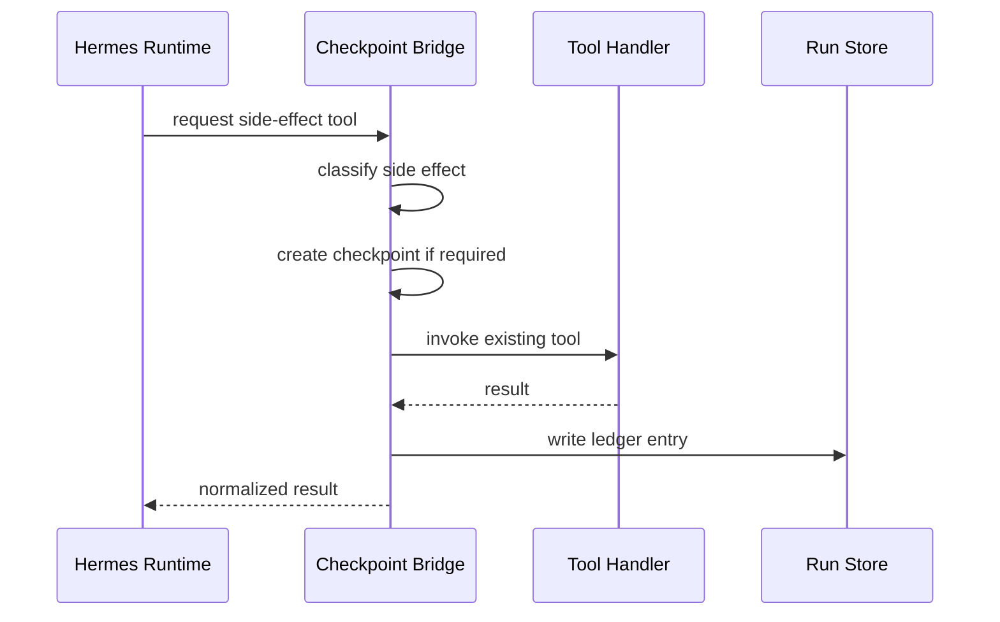

# 07 Checkpoint And Rollback

## Purpose

Hermes has mature checkpoint-aware tool execution. Our production bot already has deployment rollback, task runs, auto-fix boundaries, and tool ledgers. The complete runtime needs one policy for reversible side effects across file edits, terminal commands, deployments, and user-visible delivery.

## Side-Effect Ledger

Create:

- `app/hermes_runtime/checkpoint.py`
- `app/hermes_runtime/side_effects.py`
- `tests/test_hermes_checkpoint_policy.py`

Every side-effecting tool call must produce a ledger entry:

```json
{
  "run_id": "tr_20260521_abc123",
  "tenant_id": "pm-bot",
  "tool_name": "self_edit_file",
  "side_effect_class": "code_mutation",
  "checkpoint_id": "cp_abc",
  "target": "app/tools/skill_engine.py",
  "status": "completed",
  "rollback_available": true,
  "user_visible": false,
  "created_at": "2026-05-21T12:00:00Z"
}
```

## Checkpoint Classes

| Class | Before Action | Rollback |
|---|---|---|
| File edit | Git worktree diff snapshot or commit checkpoint | Reverse patch or restore checkpoint branch |
| Terminal command | Check command destructiveness and working dir | Only if file diff checkpoint exists |
| Deployment | Existing `self_safe_deploy` rollback point | Revert to prior commit/container |
| Calendar/task/doc write | Store platform object id and previous state when available | Update/delete through platform API |
| Message send | Store message id and delivery result | Cannot unsend reliably; mark as irreversible |
| File export | Store artifact id and source template | Artifact deletion or replacement |

## Approval Gates

Use existing user/admin confirmation mechanisms. Hermes cannot self-approve:

- Destructive terminal command.
- Infrastructure action.
- Production deploy.
- Sending external messages on behalf of a user when policy requires confirmation.
- Skill script execution.

The runtime response status must be `needs_confirmation` with a structured approval request.

## Auto-Fix Boundary

The current production rule remains:

- Auto-fix may write application-layer paths such as `app/tools/` and `app/knowledge/`.
- Infrastructure paths are read-only to auto-fix.
- Hermes code mutation tools must call the same boundary checker before file writes.

Runtime integration code under `app/hermes_runtime/` is infrastructure-level for auto-fix until explicitly reclassified.

## Recovery Flow



If the runtime crashes after a side effect:

1. Task run state remains `partial` or `resumable_paused`.
2. Ledger shows last completed side effect.
3. Resume path asks Hermes to continue with ledger context.
4. If side-effect state is unknown, pause and request operator review.

## Tests

- Code mutation tool creates a checkpoint before execution.
- Read-only tool does not create a checkpoint.
- Message send is recorded as irreversible.
- Destructive command without approval returns `needs_confirmation`.
- Auto-fix-protected path remains blocked through Hermes runtime.
- Runtime crash after completed tool produces a recoverable ledger entry.
